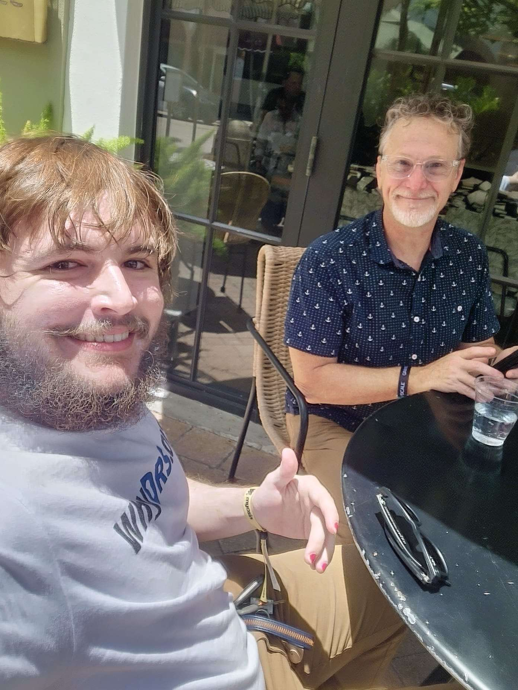

# Meeting with DTCC DA CTO Dan Doney

Says competition between agents will produce innovation.

Says doing it at DTC or with agents is the same.

"DTC can act as agent" role.

1. Did not differentiate between DRS and Cede.
2. Repeated entitlement points.
3. Proposed deploying real-time settlement token and a T+1 entitlement.
4. Says that the two could trade at different values.

5. Used to not like DTCC and wanted to take them down.
6. Specifically wanted to take the industry to "T Zero."
7. Says now that the margin ability is important, that collateral matters.
8. Stated that Robinhood was undercapitalized, which is why the button freeze happened.
9. Re Chives notes, so no sun.

10. Specifically says that competition between agents would create innovation.
11. Does think it's as good as the monopoly standardization.
12. Says the confusion between clearing and settlement systems is what led to DTC.
13. All the hoops brokers jumped through with all the different parties was the problem the company solved.

14. Says any system the agents used together would "become DTC."
15. It would need systemic market utility regulations.
16. He says those are good rules that protect operational integrity.
17. But they are hard rules with a high burden.

18. Specifically calls out the agents working together on a common recordkeeping system.
19. How the shared model is like DTC's unification role.
20. When asked about DRS, he says everything there would be specifically different than the Cede infrastructure they are working on.

21. All proposed tokenization schemes are through Cede.
22. No permission needed from issuers to create the new token sub-ledgers and deploy wallets via broker / tech custodians.
23. Specifically calls out "tech platforms like Meta" as a service provider that could register _as a DTC Member_ to provide access to securities.
24. When asked about SEC registration, he declined to say companies like Meta would need to register with the Commission (I specifically asked if Meta would be a broker/dealer, and he said only the DTC membership bit).

25. Did not pick up the crumbs I put down about transfer agents competing with DTC.
26. Stated that DRS has no means of trading.
27. Stated that DRS already exists (but did not mention Profile).
28. Stated that shares can already move between the broker and the agents.

29. He didn't name any agents other than his own legacy and then Securitize, as per the DUNA meeting story (6 May 2026).
30. Stated DTCC could operate as the role of a transfer agent.

---

31. Launching this year.
32. When asked about clearing agency and its rules specifically, he deflected to historical role precedent.
33. Clawback work was critical for establishing control.
34. It lent the agent having control location.
35. Still used with the DTC system for central is the specific locations sense it was made for.
36. Started building on Ripple and told them they needed new features like the clawbacks to do their job.
37. Ripple did not work with them, and so they moved over to the Stellar team, who was nice and helpful.

## Messages to Chives

The above dialogue was reconstructed from memory and immediate notes the day after the meeting. It was imprudent to jot things down directly in the relaxed conversational environment. As such, I made only minor remarks through private means immediately after the discussion.

38. Started wanting to take down DTC.
39. Sees role as unifying layer.
40. Has dev _this year_ for token entitlements settling at T+1.

41. Told SpiceVC about idea in UAE 2015.

42. Carlos rebrands and enters market that year within 3 months.
43. Entitlements as tokens stay in Cede.
44. The promises are margin in NSCC.

He affirms there _will be FTDs_.

Clawbacks were needed to guarantee control location on entitlements and direct. TA consortium could be systemically regulated, which he says is _tough_.
[Dan wrote / led the clawback work in [CAP-35](https://github.com/stellar/stellar-protocol/blob/master/core/cap-0035.md) with Tomer (who was also there and introduced us).]

Spoke substantially on privacy tech with SDF team.

